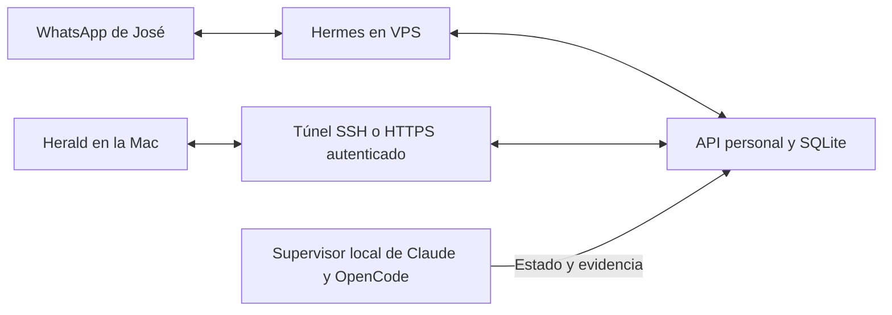

# Despliegue en un servidor elegido por José

Estado: plantilla de despliegue; no se ha ejecutado en un VPS. No hay servidor, dominio ni número de WhatsApp seleccionados en esta entrega.

La instalación local permite usar Herald y verificar el flujo. Para mensajes y rutinas continuos, Hermes y la API deben ejecutarse en una máquina que permanezca encendida. El escritorio de Herald queda en la Mac. Claude Code y OpenCode ejecutan trabajo solo en los repositorios autorizados del equipo donde está instalado su supervisor.

## Topología propuesta

La proyección de ejecuciones a la API está implementada. El despacho de trabajos desde el VPS a una Mac remota requiere configurar un canal autenticado y los scopes de esa Mac; no queda habilitado con esta plantilla. La Mac debe estar encendida para ejecutar agentes locales.

## Preparación del host

1. Crear un usuario de servicio `herald`, sin acceso de administración, y colocar el checkout revisado en `/opt/herald-personal`. Instalar Python 3.13 y uv por el mecanismo del operador.
2. Crear `services/personal/.venv` e instalar `services/personal/requirements.lock` con `uv pip install --require-hashes`. El archivo fija también las dependencias del puente MCP.
3. Crear `/var/lib/herald-personal/private` y `/var/lib/herald-personal/data`, propiedad de `herald`, permisos 0700. Generar un token aleatorio en `private/api-token`, permisos 0600. El contenido no se incluye en Git ni en el unit.
4. Completar `/etc/herald-personal/service.env` a partir de `service.env.example`. Las credenciales y la caché OAuth son archivos privados del servidor. No reutilizar una caché que otro proceso escriba simultáneamente en otra máquina.
5. Instalar `herald-personal.service` en systemd y habilitarlo. Comprobar `/healthz`, rechazo de `/v1/status` sin credencial y acceso autenticado. Reiniciar el servicio y verificar que los registros permanecen.
6. Instalar Hermes mediante su instalador y administrador de paquetes oficiales. Usar el perfil personal aislado de `integrations/hermes-personal/profiles/personal`, sustituyendo las rutas. Conectar su MCP a `http://127.0.0.1:8787`. Revisar y probar el modelo seleccionado antes de habilitar rutinas.
7. Mantener la API en loopback. Para el escritorio, utilizar un túnel SSH o un proxy HTTPS privado; no publicar SQLite ni un puerto HTTP sin autenticación. El cliente rechaza HTTP fuera de loopback y redirecciones.

## WhatsApp y rutinas

El número dedicado y el transporte deben seleccionarse antes de conectar el canal. Las cuatro rutinas entregadas permanecen pausadas. Verificar recepción, una respuesta y un mensaje programado real después de un periodo de inactividad, con deduplicación al reiniciar, antes de considerar el canal operativo. La compatibilidad de mensajes proactivos depende del transporte de WhatsApp elegido y sus reglas; disponer de una conexión no prueba que pueda entregar un recordatorio fuera de la ventana de conversación.

Los scopes de correo empiezan con lectura. Los borradores y el archivo requieren habilitación explícita y confirmación de la acción. El servicio no contiene rutas de envío ni borrado.

## Migración y recuperación

Respaldar SQLite mediante `sqlite3.Connection.backup`, no copiando solamente el archivo principal mientras existe WAL activo. Detener las escrituras durante el cambio final, restaurar el respaldo en el servidor, verificar conteos e IDs y actualizar `connection.json` del escritorio con el nuevo origen y archivo privado de token. Conservar la instalación previa hasta probar la nueva y mantener un único destino de escritura.

Un despliegue está aceptado cuando correo→compromiso conserva el ID entre GUI y MCP, el diario sobrevive a reinicios, un token revocado deja de funcionar, una rutina llega una sola vez y una tarea de código real queda registrada con su resultado y evidencia. El unit incluido no demuestra por sí solo esos resultados.
